# WEEK1:

## Lecture 2

## 一.What Makes Up an RFID System?

### **1.RFID systems are comprised of several key components:**

- **RFID Reader:** **The device that communicates with the RFID tag**, sends  interrogation signals, and receives data.

- **RFID Tags:** **Devices that store and transmit information to the reader**. Tags can  be **active**, **passive**, or **semi-passive**.
- **Antenna:** **Both the reader and the tag contain antennas** for signal transmission and  reception.
- **Middleware:** Software used to **process data between the RFID system and  enterprise applications**.

### **2.Each component plays a unique role in enabling RFID functionality and  communication.**

## 二.Operating Principle of RFID Systems

### **1.RFID typically consists of:**

- A computer
- A database
- RFID software
- A reader, which receives signals from the RFID and identifies and processes the information contained in one of more tags
- RFID middleware
- an antenna, used to transmit signals between the reader and the RFID tag
- An RFID tag (transponders), which contains the data of the element to identify

### **2.The different for analysed designations of the tags and readers may vary, depending on applications, contexts, and their hardware and software resources**

### **3.The readers are themselves connected to servers for data processing at middleware and application levels is, archiving and traceability**

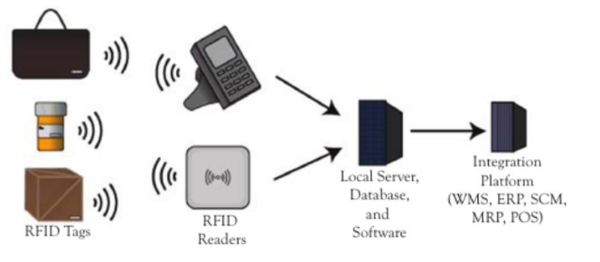

## 三.RFID READER

### **1.Readers:**

- RFID readers, also called **interrogators**, are **used to recognize the presence of nearby RFID tags.**
- An RFID reader **transmits RF energy through one or more antennas.**
- **An antenna in a nearby tag picks up this energy**, and **the tag then converts it into electrical energy via induction.**
- This electrical energy is **sufficient to power the semiconductor chip attached to the tag antenna**, which **stores the tag’s identity**.
- The tag then **sends the identity back to the reader** by **raising and lowering the resistance of the antenna in a kind of Morse code.**

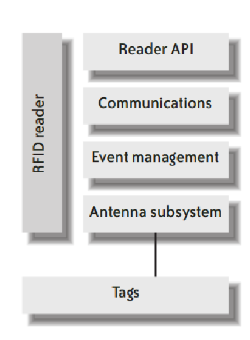

### **2.Reader’s Function:**

- As **the bridge connecting the application layer (middleware) and RFID tags**, the reader plays a significant role.
- **Energy Supply:** A reader provides **energy** for RFID tags’ work.
- **Communication:** Communication **between reader and tag**; Communication **between reader and
  application layer (middleware)**
- **Security Assurance:** Security assurance in communication, such as **encryption and decryption**

### **3.Reader Classifications: By Operating Frequency**

- RFID system’s working principle is **related to the frequency of RF signals it used.**
- The higher the **work frequency**, the further **the identification range**, the higher **the data transferring speed**, the faster **the signal attenuation**, the more **sensitive to obstacles**
- 

### **4.Reader Classifications: By Appearance**

- In practice, taking reader’s cost and portability into consideration, **the appearance of a reader varies a lot**, thus divided into the following **3 types**:
- **Fixed: **Wired charging Highly integrated Fast set up
- **Portable:** Small volume Battery charging Easy to move
- **Industrial:** Industrial related Capable of integrating other sensors

### **5.Reader’s Operational Specifications**

- To make reader’s performance meets the requirements of the application, certain operational specifications
  should be followed while using the reader.

- **R&W range (read out and write in range)** is one of the key performance metrics that affect the scope of reader
  applications. **Influencing factors:**

- **The way that antenna is coupled**

- **The output power of the reader’s RF signal**

- **The frequency of RF carrier signal**

- **Antenna direction**

- When the **polarization direction** of the reader antenna and tag antenna match, the recognition range becomes maximum. In practice, mismatch is unavoidable, where measures as followed can be applied: ***1.Change the direction of the reader antenna***，***2.Use multiple redundant antennas***，***3.Increase the power of the reader antenna***, ***4.Increase sampling rate of the reader antenna***，***5.Use a ring polarized reader antenna*** 

- **Operation environment condition**

- **Movement speed of tags**

- here are several aspects that should be **paying much more attention:**

  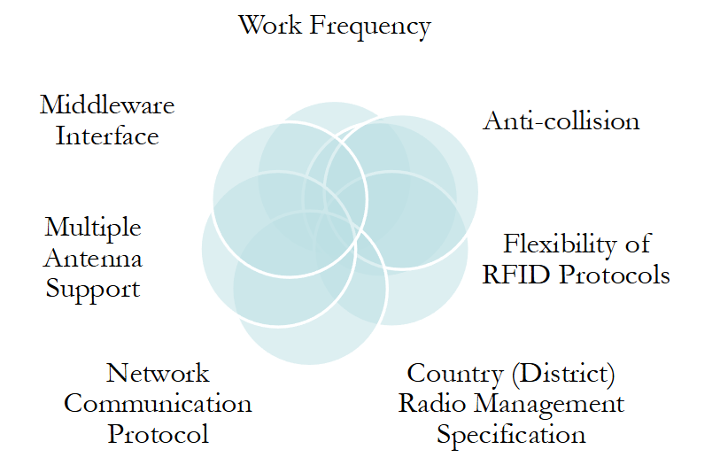  

- **Work frequency:**

  - **Work frequency ↑, data transfer speed ↑, work range ↑**
  - LF system using **125kHz**: **no more than 400b/s**
  - Systems with data transfer speed **over 100Kb/s** need **UHF/microwave**

- **Anti-collision performance:**
  - The system’s effective data transfer rate in scenario with **multiple RF tags reading and writing**
- **Flexibility of RFID protocols:**
  - **Communication protocol**: universal protocol (ISO18000-6C, EPCglobal Class1 Generation2, etc.) or exclusive protocol
- **Country (district) radio management specification**
  - **USA UHF RFID bandwidth range:** 902MHz-930MHz
  - **China UHF RFID bandwidth range**:840MHz-845MHz, 920MHz-925MHz
  - Maximum transmit power requirements
- **Communication protocols**
  - Communication interface **between reader and computer network system** (TCP/IP, 802.11, Ethernet, RS485, etc.
- **Multiple antenna support ability**
  - Whether to **support multiple antennas for one reader**
- **Middleware interface:**
  - Stable performance, easy to use
- **Connect external sensor nodes and control circuits:**
  - Combine RFID and sensor networks
  - Use PLC (programmable logic controller) to perform entry management for warehouses

### 6.RFID Reader Block Diagram

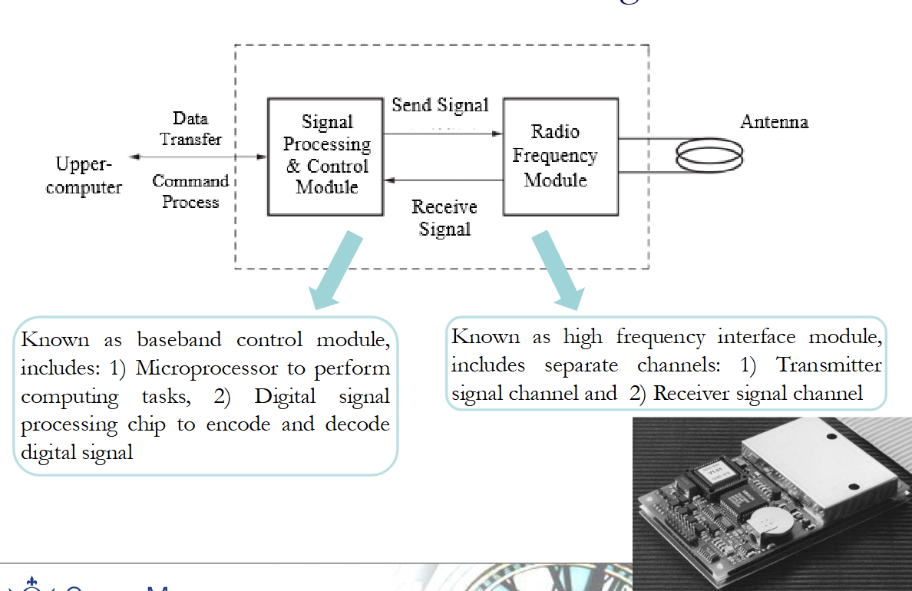

### 7.Signal Processing and Control Module

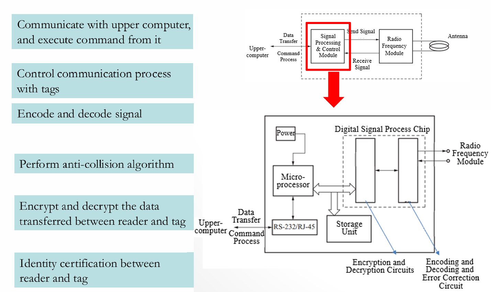

### 8.RF Module

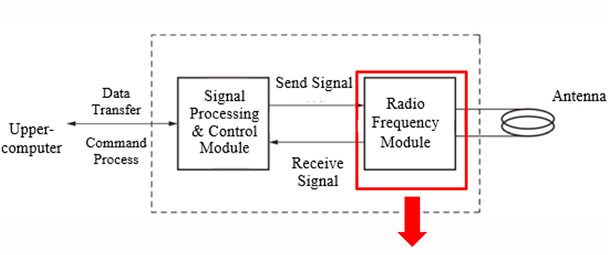

####  **8.1 2Types:**

- **Inductively Coupled RF Modules:** Ideal for short-range applications, using  magnetic fields for communication.
- **Electromagnetic Backscatter Coupled RF Module:** Suitable for longer  ranges, leveraging reflected signals for data transfer.

### 9.RF Interface

- The reader’s RF interface performs **the following functions:** 
  - **generation of high-frequency transmission power to activate the transponder and  supply it with power; **
  - **modulation of the transmission signal to send data to the transponder; **
  - **reception and demodulation of RF signals transmitted by a transponder. **
- The RF interface contains **two separate signal paths** to correspond with the **two  directions of data flow** from and to the transponder.
  - Data **transmitted** to the transponder travels **through the transmitter arm**.
  - Conversely, data **received** from the transponder is **processed in the receiver arm**. 
- We will now analyse the **two signal channels** in more detail, giving consideration to the  differences between the different systems. 

#### **9.1 Inductively Coupled RF Modules**

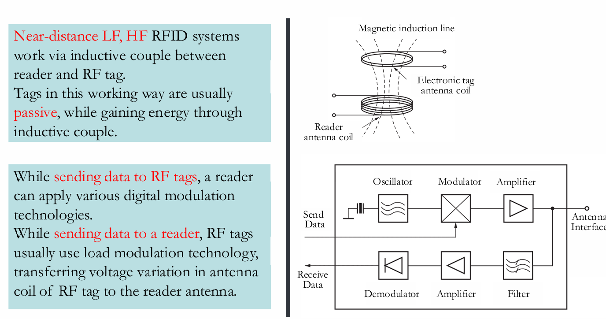

#### **9.2 Inductive Coupling**

- 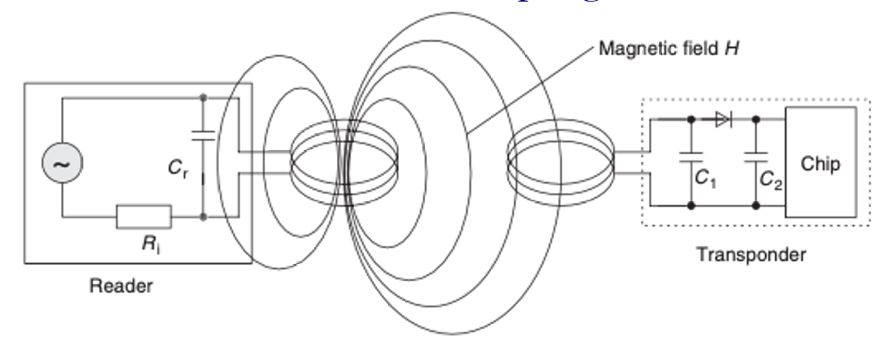
- This system typically operates at **Low Frequency (LF: 125–134 kHz)** or **High  Frequency (HF: 13.56 MHz)**.
- The reader's alternating current generates a magnetic field, which induces a current  in the transponder’s coil.
- **Limitations:** Works only in close proximity (typically a few centimeters to a meter),  depending on the frequency and coil size.

### 10.Electromagnetic Backscatter Coupled RF Module

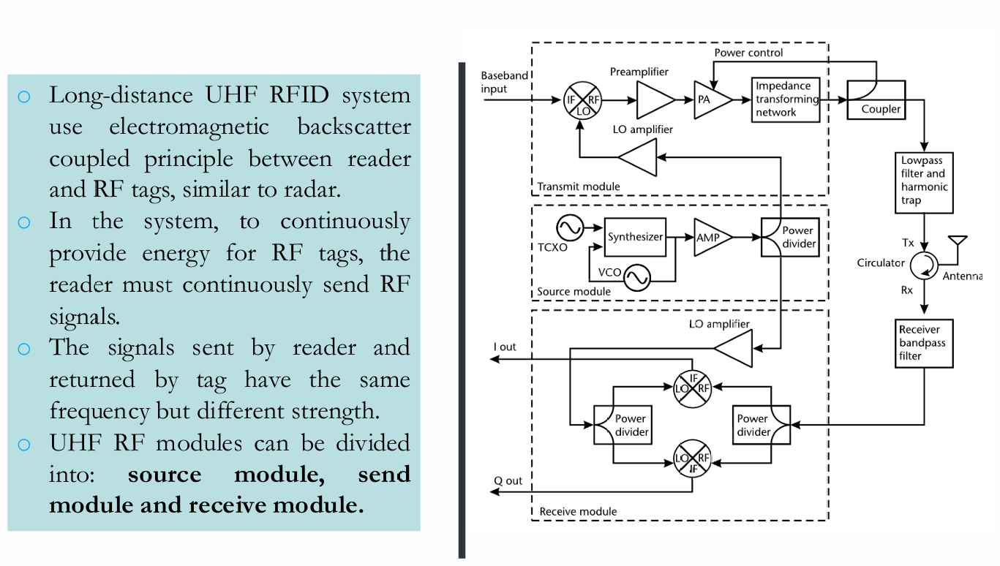

#### **10.1 Source Module：**

- 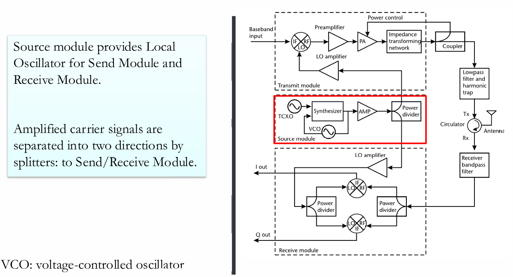

#### **10.2 Send Module：**

- 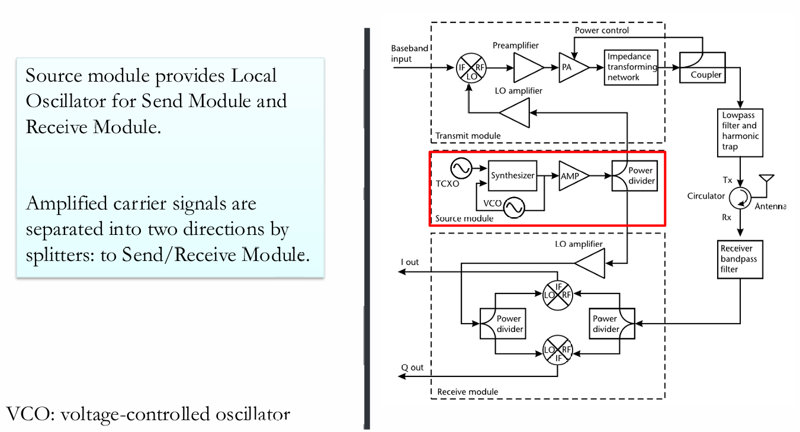

#### **10.3 Receive Module:**

- 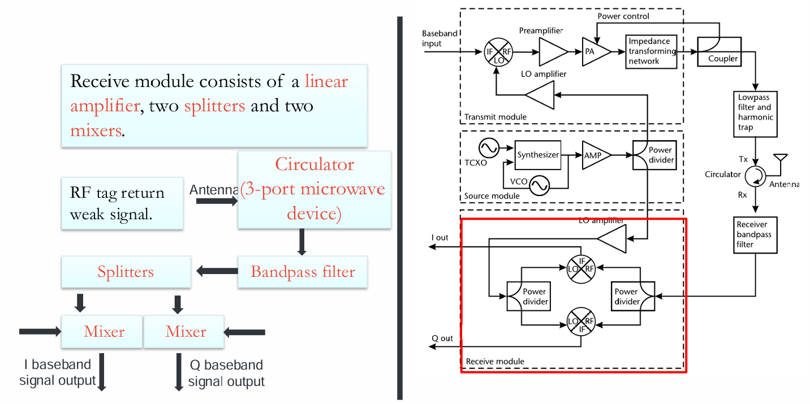

#### **10.4 Main Functions of RF Module:**

- Generate high frequency **send  energy**, **activate RF tags** and **provide  energy (passive RF tags)**
- **Modulate** signal to sent, transferring  data to RF tags.
- **Receive** and **demodulate** RF signal  from RF tags.

### 11.Reader Antenna

- The reader antenna establishes a connection between the reader electronics and the electromagnetic wave in the space.
  - **HF range:** the reader antenna is a coil (like the tag antenna) designed to produce as strong a coupling as possible with the tag antenna.
  - **UHF range:** reader antennas (like tag antennas) come in a variety of designs.
    Highly directional, high-gain antennas are used for large read distances.

- One **advantage** of highly directional antennas is that **the reader power often has to be emitted only to the spaces in which the tags that are to be read are located.**
- Generally, **the higher the gain**, **the larger the mechanical design of the antenna will be**. It follows, therefore, that highly directional antennas are not used for handheld readers.
  - Antennas typically used for handheld readers include **patch antennas**, **half- wave dipoles**, and **helix antennas**.
  - Larger antenna structures can be used for **stationary readers**; in the UHF range, they usually **take the form of arrays**.

- All other things being equal, a **high-gain antenna** will transmit and receive weaker signals **farther** than a **low-gain antenna**
  - **Omnidirectional antennas:** such as **dipole antennas**, will have lower gain than directional antennas because they **distribute their power over a wider area**
  - **Parabolic antennas:** usually have the **highest gain** of any type of antenna but not really useable in typical RFID applications, except maybe for microwave RFID readers where a long-range and narrow radiation pattern is required
  - **A half-wave dipole antenna:** will have a gain of near unity or nearly equal the isotropic antenna.
  - Reader antennas may have different requirements depending on whether they are **fixed**, **portable**, or **mobile readers**.

### 12.Selection of Antenna for Handhelds

- **Portable devices:** selection of antennas is **dominated by size and weight constraints**
  - Read range and polarization are generally **less significant** than in the case of fixed readers
  - Efficient use of RF power to maximize battery life is **critical**.
  - Highly directive antennas are useful to reduce power consumption, but are generally physically large
  - The fact that handheld reader antennas are **small and light** constrains the antenna gain.
- **The gain-size trade-off** is **important** because handheld and portable applications benefit from high antenna gain.
  - Antennas that are less than about 1/4 of a wavelength in all dimensions cannot achieve more than about 4 dBi of gain.
  - Slightly larger antennas allow up to about 6 dBi of gain, but make the reader large.
- A narrow antenna beam will **improve the ability of the user to locate the tag being read** by **changing the reader orientation and noting the results**.
- The narrow beam of a high-gain antenna is **often beneficial for a handheld reader**, since **the user can readily move the beam to cover the area of interest**.

## 四.RFID TAGS

### 1.Tags

- RFID reader transmits radio signals **at a preset frequency and interval** (**usually hundreds of times every second**).
- Any radio frequency tags that are in the reader range will pick up its transmission because each has a **built-in antenna** that is capable of listening to radio signals at a preset frequency.
- The tags use energy from the reader’s signal to reflect this signal back.
- Tags may modulate the signal to send information, such as an ID number, back to the reader

### 2.Tag Function

- The main function of RF tags is **to store a certain amount of data, and send it to the reader in a contactless manner.**
  Generally speaking, tags’ functions are concluded as:
  - **Data Storage:** Tags store goods-related information, e.g. identifier, production date, manufacturer, etc.
  - **Energy Harvesting:** Tags can **absorb energy from electromagnetic field generated by the reader**, and **generate electricity for themselves**.
  - **Contactless R&W:** Tags can be identified from **a certain distance to the reader**.

### 3.Selecting Tags

- **Required read range**: Active tags provide a longer read range than passive tags. For retail applications, the read ranges offered by passive tags are usually sufficient.
- **Material and packaging**: Different materials have differing RF characteristics. For example, liquids may impede the flow of radio waves. Metal containers also pose interference challenges to the readers
- **Form factors**: RFID tags come in different sizes. The form factor for the tags used for individual products will depend on the packaging used for these products
- **Standards compliance**: It is important to consider whether most of the readers that are generally available will understand the RF tag you select. EPCglobal and the International Standards Organization (ISO) provide standards for communications between RFID tags and readers.
- **Cost:** The cost of a single RFID tag plays an important role in its selection because most applications use many tags.
- **Classification by Package Form:**
  - **Card-like Tag:** Potable, good antenna protection, waterproof
  - **Label-like Tag:** Directly attached to the items, used in industrial production and logistics management
  - **Implantable Tag:** Animal and plant management
  - **Accessories- like Tag:** Easy to carry, no influence on the appearance
- **Classification by Work Frequency**
  - 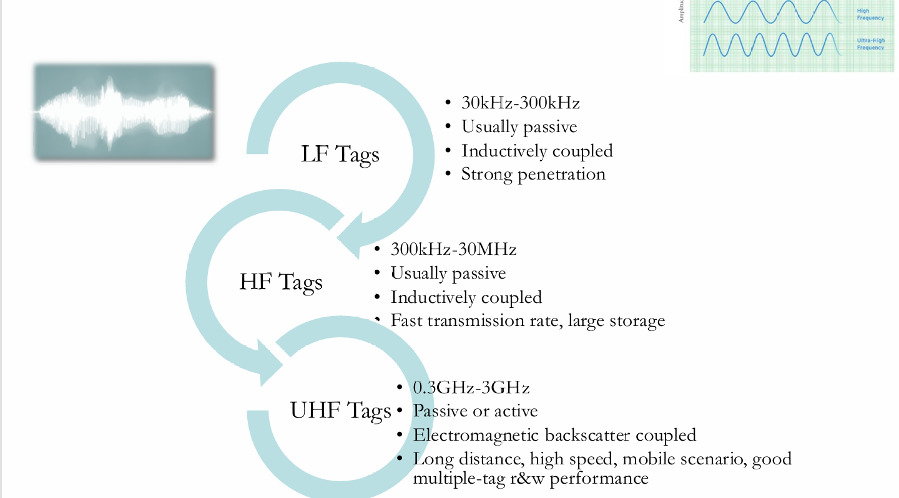

#### **3.1 Classification by Read/Write Capability**

- 

#### **3.2 Classification by Power Source**

- 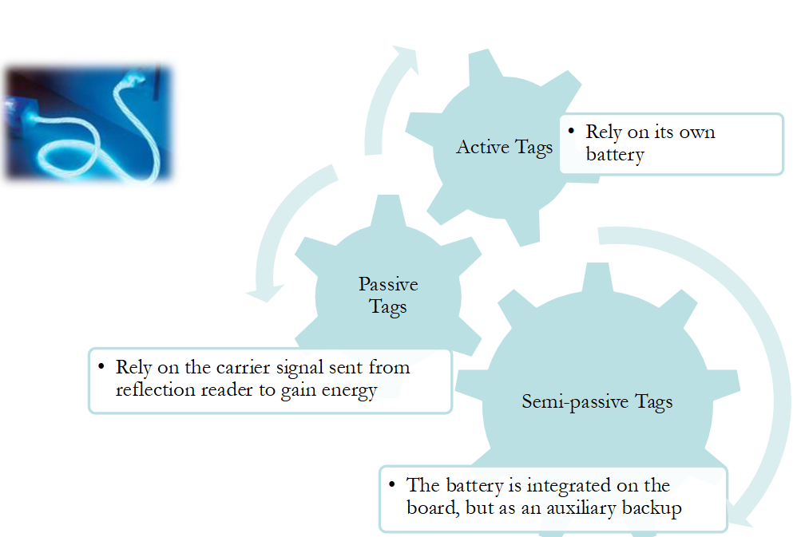

##### **3.2.1 Passive Tags:**

- **No power supply**: electrical current transmitted by the RFID reader inductively powers the device, which allows it to transmit its information back
- **Limited transmission capability**: typically, no more than an ID number.
- **Limited range of broadcast**: requiring the reader be significantly closer than an active one would.
- **Ideal for places preventing battery replacement.**
- **Applications:** include inventory, product shipping and tracking, hospitals and other medical purposes, and antitheft, can be used implanted into the human body or placed under the skin
- Tags consist of **a silicon device (chip) and antenna circuit**
  - **Purpose of antenna circuit:** induces an energizing signal and sends a modulated RF signal.
  - **Read range:** largely depends upon the antenna circuit and size.
- The antenna circuit is made of **a LC resonant circuit** or **E-field dipole antenna**, depending on the **carrier frequency**
  - The LC resonant circuit is used **for frequencies of less than 100 MHz**. At these frequencies, the communication between the reader and tag is achieved with magnetic coupling between the two antennas. An antenna utilizing inductive coupling is often called a **magnetic dipole antenna**.
- The antenna circuits must be designed in such a way to **maximize the magnetic coupling** between them:
  - The LC circuit must be tuned to the carrier frequency of the reader.
  - The Q of the tuned circuit must be maximized.
  - The antenna size must be maximized within physical limit of application requirement.
- **Backscattering for Passive Tags:**
  - Backscattering of the carrier frequency for sending data from tag to reader.
    - The amplitude of backscattering signal is **modulated with the tag’s data**
    - **Modulation data:** ASK (NRZ or Manchester), FSK, or PSK.
  - During backscatter modulation, the incoming RF carrier signal to the tag is loaded and unloaded, **causing amplitude modulation of the carrier, corresponding to the tag data bits**.
  - The RF voltage induced in the tag’s antenna **is amplitude modulated** by **the modulation signal (data) of the tag device.**
  - Amplitude modulation can be achieved by using a **modulation transistor** across the LC resonant circuit or partially across resonant circuit.
  - Changes in the voltage amplitude of the tag’s antenna can affect the voltage of the reader antenna.
    - By monitoring the changes in the reader antenna voltage (due to the tag’s modulation data), the data in the tag can be reconstructed.
    - The RF voltage link between the reader and tag antennas are often compared to weakly coupled transformer coils; as the secondary winding, tag coil, is momentarily shunted, the primary winding, reader coil, experiences a momentary voltage change.

##### **3.2.2  Active Tags(transponders):**

- **Performs a specialized task:** contain a transmitter that is always on and designed for communications up to 30m from the RFID reader.
- **Powered by on-board power source:** usually a battery about the size of a coin. It does not require inductions to provide current, as is true of the passive tags.
- **Designed with a variety of specialized electronics:** including microprocessors, different types of sensors, or I/O devices. Depending on the target function of the tag, this information can be processed and stored for immediate or later retrieval by a reader.
- **Larger and more expensive:** than passive RFID tags. The additional space taken up by a battery
- **Hold more data about the product:** commonly used for high-value asset tracking. A feature that most active tags have, and most passive tags do not is the ability to store data received from a transceiver
- **Ideal in environments with electromagnetic interference:** since they can broadcast a stronger signal in situations that require a greater distance between the tag and the transmitter.
- For the read-only device, the information that is in the memory cannot be changed by an RF command once it has been written. A device with memory cells that can be reprogrammed by RF commands is called a read/write
  device. The information in the memory can be reprogrammed by interrogator command.
- Although passive tags can only respond to an electromagnetic wave signal emitted from a reader, active tags can also spontaneously transmit an ID. There are various types of unscheduled transmission type, such as when there
  are changes in vibration or temperature.
- A semiactive or semipassive tag (naming convention depends on the manufac-turer) also has an on-board battery.
  - The battery in this case is only used to operate the chip
  - Like the passive tag, it uses the energy in the electromagnetic field to wake up the chip and to transmit the data to the reader.
  - These tags are sometimes called battery-assisted passive (BAP).

###### Active Tag Classification:

- **Wake-up tag systems:** are deactivated, or asleep, until activated by a coded message from a reader or interrogator.
  - In the sleep mode, limiting the current drain to a low-level alert function conserves the battery energy
  - Where larger memories are accommodated, there is also generally a need to access data on an object or internal file basis to avoid having to transfer the entire amount of data so held.
  - **Applications:** toll payment collection, checkpoint control, and in tracking cargo.
- **Awake tag or beacon systems:** are responsive to interrogation without a coded message being required to switch the tag from an energy conservation mode.
  - Because greater switching rate is generally associated with higher energy usage,
  - these tags generally operate at a **lower data transfer rates** and memory sizes than wake-up tags, so they conserve battery energy in this way.
  - This type of tag is **the most widely used of the two**, and because of lower component costs it is generally **less expensive** than wake-up tag systems.
  - **Applications:** most real-time locating systems (RTLS), where the precise location of an asset needs to be tracked. In an RTLS, a beacon emits a signal with its unique identifier at preset intervals, every 3 seconds or once a day, depending on how important it is to know the location of an asset at a particular moment in time.

##### 3.2.3 Active and Passive Tags Comparison

- **Passive RFID:** is most appropriate where the movement of tagged assets is **highly consistent and controlled**, and **little or no security or sensing capability or data storage** is required
  - They contain significantly more sophistication, data management, and security concerns.
  - Cost typically well below $1.
  - Small as 0.4 mm square and thinner than a sheet of paper.
- **Active RFID:** is best suited where business processes are **dynamic or unconstrained, movement of tagged assets** is variable, and **more sophisticated security, sensing, and/or data storage capabilities** are required.
  - Generally, cost from $10 to $50, depending on the amount of memory, the battery life required, any on-board sensors, and the ruggedness.
  - Small as a coin, which means that they are around 50 times the size of passive ones.
- 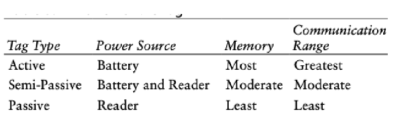

### 4.Tag Components

#### 4.1 Antenna

- Decides the size of tag.
- Receive RF signal from the reader;
- Send chip data to the reader;
- Provide energy for passive tags;

#### 4.2 Chip

- Demodulate and decode signal received by the antenna,
- encode and modulate the signal to send from the tag,
- and perform anti-collision algorithm and store data.

#### 4.3 Tag Antenna

- An antenna is a conductive structure specifically designed to couple or radiate electromagnetic energy.
- Antenna structures, often encountered in RFID systems, may be used to both transmit and receive data-modulated energy:
  - In the low-frequency (LF) range with short read distances, the tag is in the near field of the reader antenna, and the power and signals are transferred by means of a magnetic coupling. In the LF range, the tag antenna therefore comprises a coil (inductive loops) to which the chip is attached.
  - In the UHF range with larger read distances, the tag is located in the far field of the reader antenna.
- Good antenna design is a critical factor in obtaining good range and stable throughput in a wireless application.
- Printed antennas are very easy to produce. The antenna is attached as a flat structure to a substrate and connected it to the chip. This assembly is called an inlay. An inlay becomes a tag or transponder when it is fixed to an adhesive label or a smart card.

##### 4.3.1 Tag Antenna Types

- The size and shape of the tag antenna have a significant effect on tag read rates, regardless of the coupling used for communication.
- There are various types of antennas available: dipole, folded dipole, printed dipole, printed patch, squiggle, and log-spiral.
  - **Omnidirectional antennas:** can be read in all possible tag orientations. Among these are the dipole, folded dipole, and squiggle antennas.
  - **Directional antennas:** have good read range due to their radiation patterns.
- Care must be taken while choosing an antenna because the antenna impedance must match to the ASIC and to free space.
- Four major considerations when selecting an antenna type are as follows:
  - Antenna impedance;
  - Antenna radiation pattern;
  - Nature of the tagged object;
  - Vicinity of structures around the tagged object.
- Bring **redundancy** to the system, when individual system performance is not satisfactory.
- Generally, the smaller the tag size, the less the antenna radiation impedance, the shorter the tag work range, the lower the work efficiency. Antenna performance includes direction property, antenna efficiency, antenna gain, etc.
- According to work principle, tag antenna has 3 types:

###### Coil Antenna:

- Simple process, low cost, widely used in **LF**, **HF close-range RFID system**.
- Work by **inductively coupled**, whose principle similar to transformer. The reader antenna is equivalent to transformer primary coil, tag antenna as secondary coil, generating voltage at a varying magnetic field.
- Charged by **parallel capacitors**, generate power for tag chip.

###### Microstrip Patch Antenna:

- A microstrip patch antenna is usually **attached to the surface** of a conductor sheet, with a **metal foil** ground plane on the other side.
- Light weight, small size, low cost, easy to mass production.
- Suitable for scenario of which the communication **direction doesn’t change**.

###### Dipole Antenna:

- A dipole antenna consists of **two straight wires** with the same length and thickness put in a straight line.
- Suitable for **UHF** tags.
- **Typical antennas:** half-wave / double line folded / triple line folded / double dipole antenna.
- A dipole antenna is **omnidirectional** antenna.

#### 4.4 Tag Chip

- The RFID chip is is an integrated circuit implemented in silicon consisting of:
  - an **RF front end**, a **control unit** consisting of some additional basic signal processing circuits, logic circuitry to implement the algorithms required, and EEPROM for **data storage**.
- The major blocks and their functions of the RFID front end are:
  - **Rectifier:** From the coupled EM field it generates the power supply voltage for all the electronic circuits;
  - **Power (voltage) regulator:** Maintains the power supply at a certain level and at the same time protects the circuit from the excessively large input RF power;
  - **Demodulator:** Extracts the data symbols embedded in the carrier waveforms;
  - **Clock extraction or generation:** Extracts the clock out of carrier (usually in HF systems) or generates the system clock;
  - **Backscattering:** Modulates the return link by alternating the impedance of the chip;
  - **Power on reset:** Generates the chip power-on reset (POR) signal;
  - **Voltage (current) reference:** Generates some voltage or current reference for the use of front-end and other circuit blocks, usually in terms of bandgap reference;
  - **Other circuits:** They include persistent node or short-term memory, electro-static discharge protection, and so forth.

##### 4.4.1 Simulation front end:

-  the rectified antenna input signal provides a stable voltage, the antenna input is detected to obtain a digital signal, modulate control unit signal for antenna to send, provide clock for control unit.

##### 4.4.2 Control unit:

- data decode, check, encode, encryption, decryption, anti-collision, read/write control.

##### 4.4.3 Storage unit:

- tag data carrier

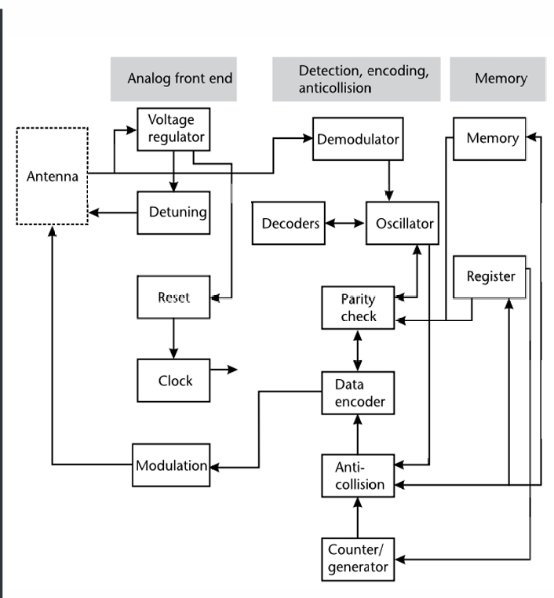

##### 4.4.4 Chip Assembly

- **Major challenge in assembling:** small size of the chip itself, the need for low temperature attachment and the required throughput capacity.
- **Standard flip-chip technology:** attaches the chip to the antenna roll using standard flip-chip technology and dispensing fast curing conductive adhesive at high speed using pick-and-place (PnP) equipment.
- **Strap attach:** attaches the chip to a polymeric carrier film in roll form at high density and high velocity using roll-to-roll equipment.
  - This polymeric carrier has previously been prepared with small caves on the surface to receive the chip, which corresponds to large conductive pads
  - Once this step is completed, it is possible to couple the roll containing the straps with the roll containing the antennas and accomplish the final assembly by using **dispensed adhesive**.
- **Advantage of strap attach:** possibility to assemble chips at a very high velocity.
- **Disadvantage:** is that the process consists of **two-step phases** and that the singulation of the strap causes a reduction in the speed of the process.

#### 4.5 Tag Wake Circuit

- Rectifier→1V voltage output →Transistor connection
- Rectifier→5mV voltage output →Compare with reference voltage →Transistor connection

#### 4.6 Tag Manufacturing Process

- **Main methods of tag manufacture :** Coil winding, chemical etching, printing
- **Manufacture process:** Antenna produce and chip assembly
- **Chemical etching:**  is an established technology used for the realization of printed electronic circuit boards.
- **Conductive ink printing:** is the process based on flexographic equipment, in which the antennas can be printed
  on a polymer roll in a single step with no need for masking.

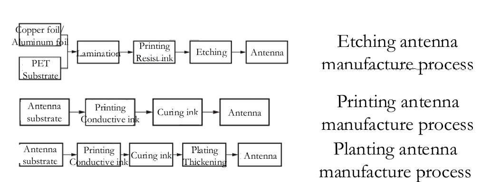

#### 4.7 Multiple Tag Operation

- If many tags are present, then they will all reply at the same time, which at the reader end is seen as a signal collision and an indication of multiple tags

- **Anticollision algorithm:** allows tags to be sorted and individually selected

- **Many different types of algorithms:** binary tree, ALOHA, and so on, which are defined as part of the protocol standards.

- Number of tags that can be identified: depends on the frequency and protocol used and can typically range from 50 tags per second for HF and up to 200 tags per second for UHF.

- Once a tag is selected, the reader is able to perform a number of operations, such as reading the tag’s identifier number or, in the case of a read/ write tag, writing information to it.

- After finishing its dialogue with the tag, the reader can then either remove it from the list or put it on standby until a later time.

- This process continues under control of the anticollision algorithm until all tags have been selected.

- When containers or freight are moved on a conveyor or similar equipment in a tag reader system, the reader/writer must read and write data to and from moving tags.

- For successful access, the following conditions must be satisfied:

- $$
  T_c = A_{cn} \frac{D_t}{D_r}
  $$

  $A_{cn}[count]$ = average number of tag-reader/writer operations

- This formula shows that when the data transfer volume of the tag ( $D_{t}$ in bps) increases, and the data transfer rate ($D_{r}$ in bps) decreases, the tag-reader/writer operation time ($T_{c}$ in seconds) increases, and operation may fail.

- When the reader/writer operating area decreases, the distance the tag moves ($L$ in m) decreases, and the tag movement velocity ($V_{tag}$ in m/second) increases, the amount of time the tag is in the operating area ($D_{r}$ in seconds) decreases,
  and the operation may fail.

- $$
  T_r = \frac{L}{V_{tag}}
  $$

- The total amount of time spent in the operating area must be more than the total time taken by the reader/writer and the detection of all tags

- $$
  T_r \geq T_c + T_d
  $$

- If only one type of tag can be used when reading/writing RFID tags attached to freight on a conveyor belt, the reader/writer antenna must have a large operating area to cope with the conveyor belt’s speed.

- In a multiple-tag operation, the reader/writer must detect the presence of these multiple tags and read/write each of them
  consecutively.

- This operating method is generally referred to as the **anticollision protocol** and is different from the single-tag operation
  protocol.

- The operating time of multitag operation is several times longer than for single-tag operation.

- The time increases in proportion to the number of tags

- For $N_{tag}$ in the operating area,, the amount of time for which the tags are in the operating area ($T_{r}$) is

  - $$
    T_r \geq (T_c + T_{tag})N_{tag}
    $$

- In most cases, the tags are moving. The reader/writer will generally have to read/write RFID tags attached to containers or freight being transported on a conveyor belt or trolleys.

- When $T_{c}$ is the operating time for a single tag, and $T_{d}$ is the time required to check for the existence of $N$ multitags in an anticollision protocol, the maximum time required for the reader to read/ write all $N$ tags ($T_{N}$ ) is approximated by:

  - $$
    T_N = (T_c + T_{d})N_{tag}
    $$

- For the reader/writer to read/write all the tags:

  - $$
    T_r \geq T_N
    $$

#### 4.8 Overlapping Tags

- In inductive frequency band RFID, the resonance characteristic of the tag antenna coil is used for reader/writer operation.

- The tag’s resonant frequency, $f_{0}$, is calculated by:

  - $$
    f_0 = \frac{1}{2\pi \sqrt{LC}}
    $$

    $L[H]$ is inductance of tag antenna coil;

    $C[F]$ is capacitance of tag’s tuning capacitor.

- If tags overlap, the inductance of their antenna coils is obstructed, and L increases.
- In this case, the resonant frequency expressed by formula becomes lower ($f_{1}$ < $f_{0}$)
- As a result, the electromagnetic waves (current i) generated by the tag’s coil become **smaller**, and the operating area **decreases**.

### 5.RFID Middleware

- One of the primary benefits of using RFID middleware is that it **standardizes ways of dealing with the flood of information these tiny tags produce**.

- 5.1Three primary motivations for using RFID middleware:

  - **Providing connectivity with readers (via the reader adapter),**

  - **Processing raw RFID observations for consumption by applications (via the event manager),**

  - **Providing an application-level interface to manage readers and capture filtered RFID events.**

### 6.RFID Power Sources

- RFID tags need power to **sense, compute**, and **communicate**, which is further classified into three categories:
  - **Storage:** batteries, capacitors.
  - **Energy harvesting mechanisms:** vibrations/movement, photovoltaic, thermal gradient, and so on.
  - **Energy transfer:** inductive coupling, capacitive coupling, backscatter.
- Because many of these devices are expected to operate with minimum of human intervention, optimizing power consumption is a very important research area.
- RFID tags may derive the energy to operate either from an on-tag battery or by scavenging power from the electromagnetic radiation emitted by tag readers.
- Storage refers to the way devices store power for their operation done either by using batteries or by using capacitors
- Batteries are used when a longer life is required and capacitors are used in applications that require energy bursts for very short durations

#### 6.1 Power Harvesting Systems

- Power harvesting (sometimes termed energy scavenging ) is the process of acquiring energy from the surrounding environment (ambient energy) and converting it into usable electrical energy;
- The energy transfer is the way by which passive RF devices are powered.
  - **Inductive coupling:** is the transfer of energy between two electronic circuits due to the mutual inductance between the two circuits.
  - **Capacitive coupling:** is the transfer of energy between two circuits due to the mutual capacitance between the two circuits.
  - **Passive backscattering:** is a way of reflecting back the energy from one circuit to another.
- Passive tag is powered through **inductive coupling or far-field energy harvesting**

#### 6.2 Active Power Sources

- Battery-assisted backscatter tags have their own power source to preenergize the silicon chip. Lithium batteries offer a set of performance and safety characteristics optimal for RFID tag applications. Two types of batteries that are most common are:
  - **Primary lithium/manganese dioxide ($Li-MnO_{2}$ ):** relatively safe compared to LiSOCL2, does not develop any gas or pressure during battery operation, cannot operate at voltages greater than 3V
  - **Lithium-thionyl chloride ($Li-SOCL_{2}$ ):** It has the highest open-circuit voltage of 3.6V.

### 7.Software System Component

- **The software components are the soul of RFID system.**

#### 7.1 Work Process

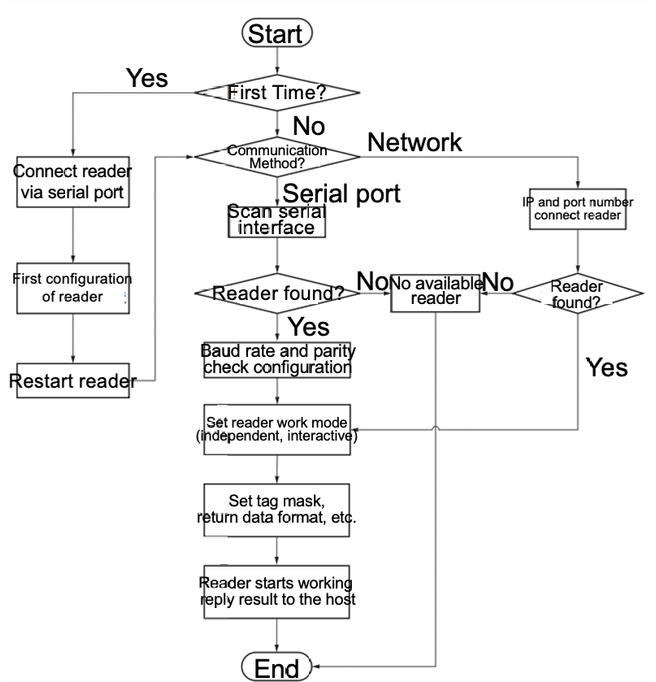

- **Exp**

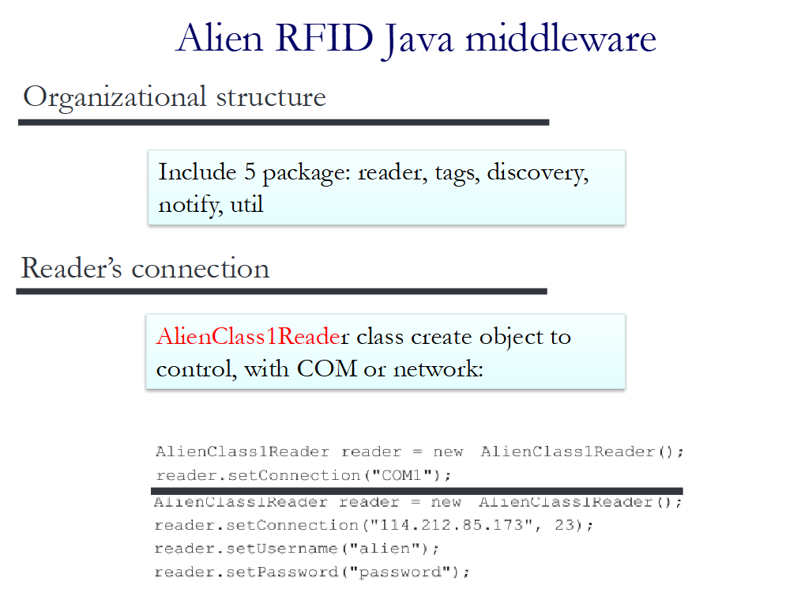

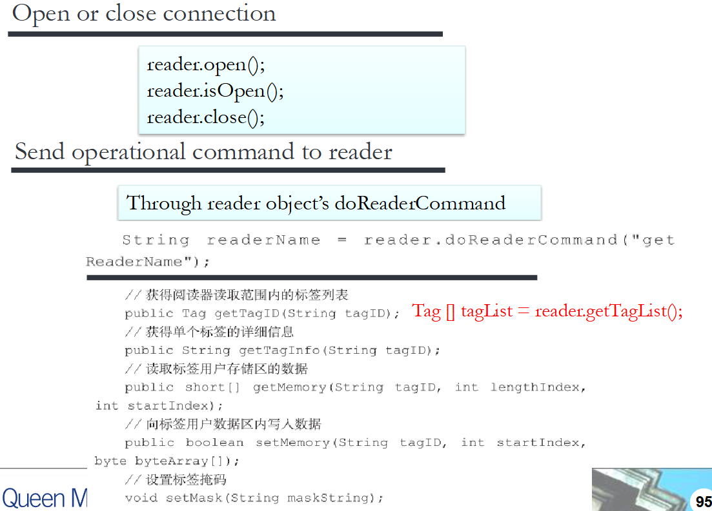

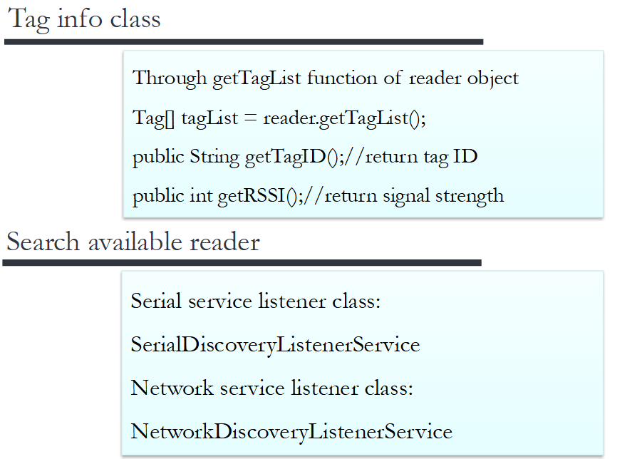

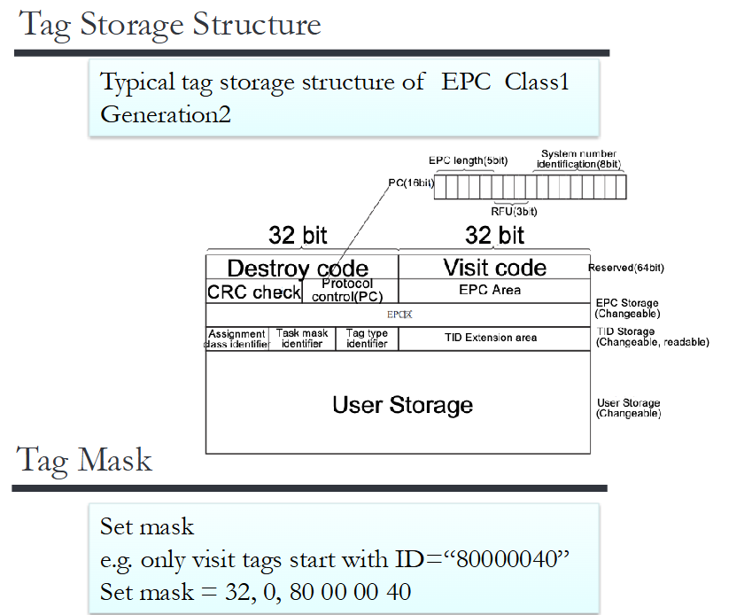

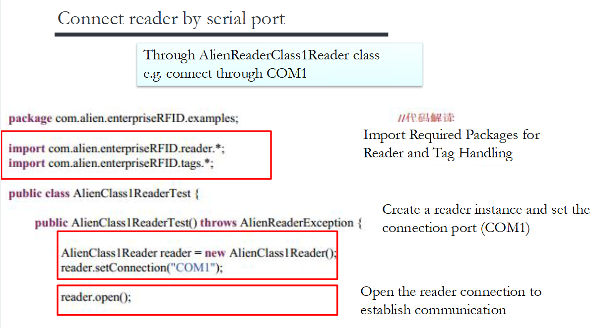

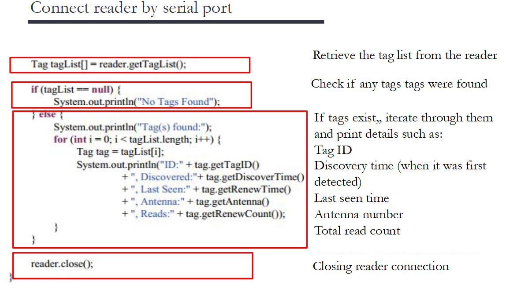

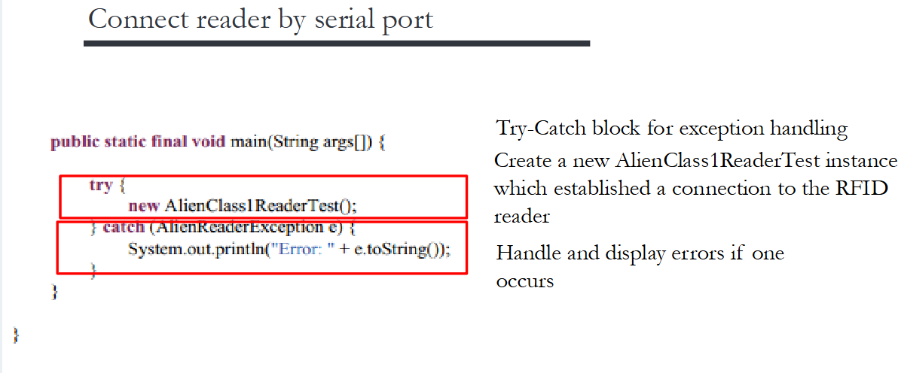

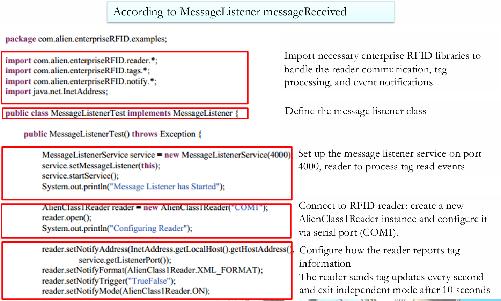

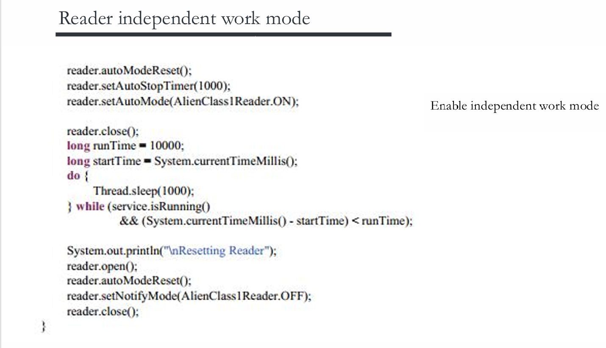

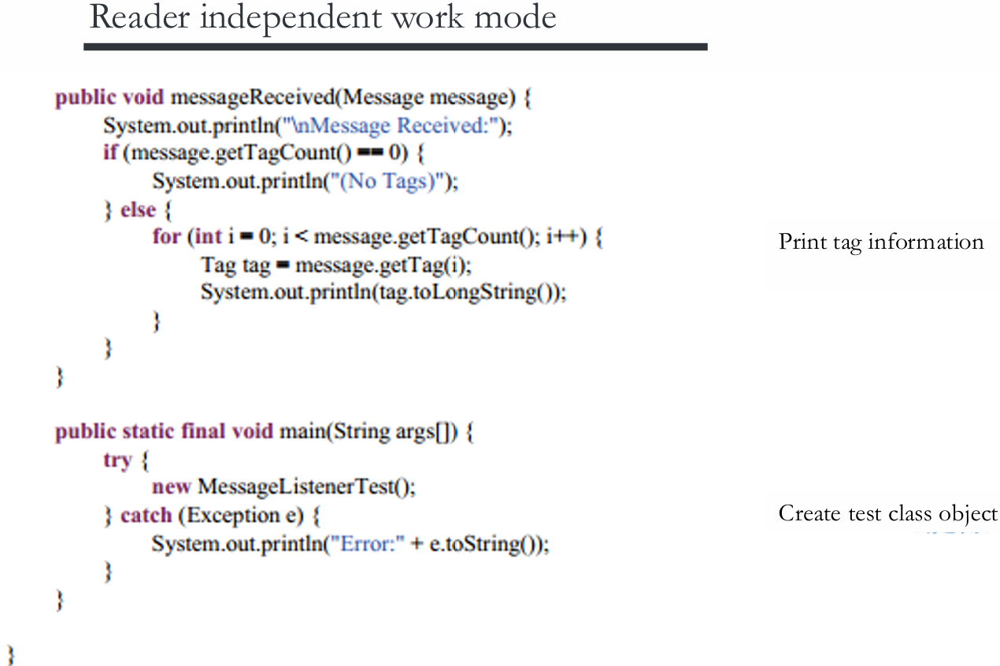
