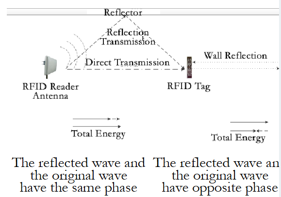
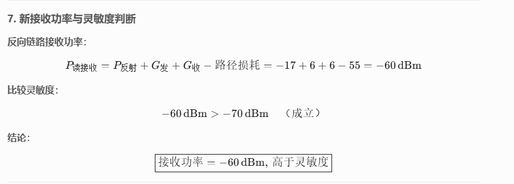

# WEEK2:

## Lecture 3:

### 一.RF Spectrum and Electromagnetic Signal Transmission

- **Electromagnetic waves** are energy and momentum transmitted as waves caused by **same-phase oscillation between mutual perpendicular electric field and magnetic field**.

#### 1.Electromagnetic Waves

- **Propagation vector or Poynting vector**: is the power flow density of the EM wave, vector $P=E \times H$  in the direction of propagation, and measured in watts per square meter.
- **Electromagnetic field**: can be described in terms of the electric and/or magnetic field strength at that location.
- Like any wave-related phenomenon, electromagnetic energy can be characterized by a **wavelength** and/or **frequency**.
  - **Frequency f**: is defined as a number of cycles, or periods, per unit of time and is measured in hertz (Hz).
  - **The wavelength $\lambda$**: is the distance by which the phase of the sinusoidal wave changes by 2π radians, so we can say: $k\lambda=2π$, $w=kc$ , and  $f=w/2π$
  - **Angular frequency w**: is a rotational unit of angular frequency $2πf$ with units in radians per second (rad/s).

#### 2.Electromagnetic Spectrum

- 
- Modulate various wireless signals to **carrier signals** with **different frequencies** to transmit.

#### 3.RF Spectrum and Electromagnetic Signal Transmission

- **LF**: 30kHz~300kHz, usually passive tags, communication range < 1m, not be disturbed by any material except for metal, typical work frequency: 125kHz~134kHz
- **HF**: 3MHz~30MHz，usually passive tags, communication range < 1m, typical work frequency: 13.56MHz
- **UHF**: 300MHz~3GHz, passive or active tags, communication range > 1m, cannot go through many materials, especially for water, dust, fog and other suspended particulate materials, typical work frequency: 433MHz ，860MHz~960MHz
- **SHF**： passive or active tags, communication range > 10m at most, typical work frequency: 2.45GHz，5.8GHz（microwave signal）

#### 4.RF Spectrum and Electromagnetic Signal Transmission 

- Different carrier frequency decides different work principles：
  - **LF & HF RFID tags**: often inductively coupled, short communication range, magnetic field energy decays as the speed of cubed distance
  - **UHF & SHF RFID tags**: often electromagnetic backscatter coupled, long
    communication range, energy decays as the speed of squared distance

### 二.SIGNAL VOLTAGE AND ENERGY

#### 1.Signal Voltage and Energy

- **The changing electric filed** can be described by the function of voltage or current.

$$
V(t)=v_0 \cos(ωt)
$$

- **The magnitude of the energy** is expressed by the power.

$$
P = I \cdot V = \frac{V^2}{R}
$$

- The electric field varying according to the sinusoidal law, can be calculated as one cycle of current energy by calculus and divided by time, so as to obtain the **average power**.
  $$
  P_{av} = \frac{v_0^2}{2R}
  $$

- The relative change is more worthy of attention in the signal processing problem.

- Use decibels **(dB)** instead of watts **(W)**

- Decibels are relative

- The **reference power** is needed when describing the specific power.

- Commonly used is 1mW. Here the dB size is **dBm**.

- **dB 是相对单位，dBm是绝对单位**

- $$
  G_{\text{dB}} = 10 \log_{10} \left( \frac{P_2}{P_1} \right)
  $$

  $$
  \text{dBm} = 10 \log_{10} \left( \frac{P}{1 \, \text{mW}} \right)
  $$

- 几个重要结论：

- 对 $-30dBm+30dB=0dBm$ 的解释：

**对于$0dBm+30dB=30dBm=1W$ ,证明步骤类似于上**

- **Continuous Wave**, CW:
- A simple periodic sinusoidal signal whose frequency, phase, amplitude don’t change.
- **It can’t carry information**, thus needs modulation: m(t) contains baseband
  information, cosine is carrier.

$$
V(t) = m(t) \cdot \cos(\omega_c t)
$$

- When m(t) is also cosine signal, according to trigonometric function:
- This sinusoidal modulation divides the signal into two signals, called **sidebands**. One’s frequency is **higher than the carrier** (first part of the formula), while the other’s is **lower than the carrier** (second part of the formula).

$$
V(t) = \cos(\omega_m t) \cdot \cos(\omega_c t) \quad \left( \omega_m \ll \omega_c \right) = \frac{1}{2} \left\{ \cos\left[ (\omega_c + \omega_m)t \right] + \cos\left[ (\omega_c - \omega_m)t \right] \right\}
$$

#### 2.Modulation and Multiplexing of Reader Signal 

- Generally, it is digital modulation that is usually performed on RFID reader signal. **(Digitally Modulated)**
- On-Off Keying (OOK): **high power for 1, low power for 0.**
- An actual binary string will be converted into a section of electromagnetic waves with high or low power.
- For **passive RFID tags,** the low energy of data bit 0 can’t activate the tag, not to mention normal work.
- **Solution:** Encode binary data bits before modulation.
- **Pulse Interval Encoding(PIE):**
  - **“1”：output a long time of high power followed by a short time of low power**
  - **“0”：output a short time of high power followed by a short time of low power**
- consider the **interference** problem
  - **FDMA (Frequency Division Multiple Access)**：need different applications to use different carrier frequencies to transmit information, and receivers only demodulate signals with specific frequencies
  - **ALR-9900 reader**: work frequency is 902.75MHz~927.25MHz, divide into 50 channels, with each channel using 500kHz frequency scope
  - In realistic applications, still need to pay attention to the deployment of readers, and the interference of other signals in the surrounding space.

#### 3.Backscatter Mechanism and Tag Encoding

- Any object that receives certain electromagnetic waves will transmit the same series of electromagnetic waves.
- **The electromagnetic waves modulated by the receiver can return to the antenna of the transmitter, and produce a recognizable signal**, which is called **backscatter signal**
- The reflected signal vector received by the receiver at a certain time is the **vector superposition** of various signals in space.
- As shown below, the superposition leads to uncertainty. If backscatter mechanism is to be used, certain encoding mechanism is to be designed to make receiver able to recognize these signals according to the variety, instead of worrying about the phase or amplitude of the signal
- Currently, tag encoding methods are based on a specific time interval to count tag changes or based on the tag state change
  frequency.
- Belonging to **frequency shift keying(FSK)** variants.
  - “1”could be 50 turns of tag state change in 1ms
  - “0”could be 100 turns of tag state change in 1ms

- In realistic receivers, there are usually existing noises and some interference signals together with the expected signal
- For different modulating and encoding methods, there is always a constraint value for the **Signal to Noise Ratio (SNR, i.e., S/N)**
- **FM0**: 10dB or larger SNR
- Readers in the PIE way have similar SNR constraints

#### 4.Link Budget

- Tags get energy from backscatter mechanism .

- The process from tags to the reader 

- The energy transfer and loss process will be analyzed.
- Link budget: **forward link budget** and **backward link budget**.
  - **Reader’s transmit energy**
  - **Path loss**
  - **Tag activate energy**

#### 5.Path Loss

- **Path Loss:** In transmission process, the difference between actual energy sent from transmitter and that received by receiver.
- Assume that the antenna transmission is isotropic, that is, the antenna radiates energy uniformly in all directions, as
  shown on the right.
- The actual energy received by the tag is proportional to the antenna’s energy density across the tag.
- This area is called the **Effective Aperture** (Ae) of the tag antenna: **the actual area of the electromagnetic wave through the tag antenna**.

- For antennas with effective aperture $A_e$, while receiving plane wave with energy density $\rho$, the energy received is 

$P_{RX} = \rho A_e$

- In the instance of an isotropic antenna, the energy density at $r$ is the ratio of transmit energy $P_{TX}$ and sphere.
- The received energy $P_{RX}$ at the tag is:

$$
P_{RX} = P_{TX} \frac{A_e}{4\pi r^2}
$$

$$
A_e = \frac{\lambda^2}{4\pi} \approx 86\,\text{cm}^2
$$

$\lambda$ is the wavelength of 915MHz signal.

#### 6.Tag Active Energy: Forward Link

- At tag reading phase, the tag needs an energy of **10~30𝝁W** to activate the circuit.
- But current energy utilization is merely 30%. Hence, the tag needs to obtain 30~100$\mu$ W. Because the maximum energy a reader can provide is 1W (30dBm), here the threshold of the chip is set to 100 $\mu$W (-10dBm), thus the max path loss is 40dB.

- The right figure draws a straight line with the start at (1m, -1.5dBm) and the slope -20dB/10m to represent the **forward link attenuation mode**.
- Backward link loss needs to consider the tag’s transmit energy and the minimum energy required to read tag data for the
  receiver.
- Tag’s receive energy is -10dBm, but actual reflection energy is about 1/3 (with -5dB attenuation).
- Since the required energy for a reader to recognize differs for different tags, assume a reasonable threshold: -75dBm.
- The energy loss graph of the backward link can be plotted against the forward link energy graph.
- Reader’s receiver obtains energy -55dBm, 20dB more than the required energy.

#### 7.Tag Activate Energy 

- The energy received from the reflection link is inversely proportional to the distance from the fourth power:

$$
P_{{RX},\text{back}}: \frac{1}{r^4}
$$

#### 8.Basic Antenna Parameters

- A transmitting antenna is a device used to transform an RF signal, traveling on a conductor, into an electromagnetic wave in free space.
- A receiving antenna performs an inverse function.
- Antennas demonstrate a property known as reciprocity, which means that an antenna will maintain the same characteristics regardless if it is transmitting or receiving.
- Most antennas are **passive resonant devices**, which operate efficiently over a relatively narrow frequency band.
- When a signal is fed into an antenna, the antenna will emit radiation distributed in space in a certain way
- A graphical representation of the relative angular distribution of the radiated power in space is called a radiation pattern.

#### 9.Effects of Antenna Gain and Polarization on Transmission Range

- **Antenna gain**: Under the condition of the same input power, the power density ratio of signal generated at the same point in space by actual antenna and ideal radiation unit. It quantitatively describes the extent to which an antenna concentrates the input power.
- **Polarization**: A phenomenon that things under certain conditions undergo polarization, making its properties deviate from the original state.
- For RFID readers with output 1W, with the help of **omnidirectional antenna**, signals can only transmit 2-3m, which is more suitable for scenarios in which the reader is surrounded by tags
- In practice, the reader will be placed at the edge of a certain region, while plenty of tags are placed at the center, forming a region which is in a certain angle range radiated by the reader.
- **Directional antenna can concentrate the energy in one place.**
- For RFID application scenarios, directional antennas make full use of the transmission energy, maximizing energy utilization, while reducing energy waste caused by scanning unwanted regions
- Below is the radiation model of a directional antenna.
- For any angle d relative to the center of the antenna, the edge of the curve represents the energy density of the antenna radiated in this direction.

$$
G = \frac{4\pi r^2}{\Omega_{beam} r^2} = \frac{4\pi}{\Omega_{beam}}
$$

**其中，$\Omega_{beam}$为波束宽度**

#### 10. Effects of Antenna Gain 

- **Plane angle (unit: radians)**: The plane angle corresponding to the arc with the vertex at the centre of the circle and the arc length equal to the radius 𝑟 is set to $1 rad$ , and the angle corresponding to the circumference of the circle (2πr) is $2π rad$

- **Solid angle (unit: solid radians 𝑠𝑟)**: The vertex is at the centre of the sphere and the solid angle corresponding to the spherical surface with an area equal to $r^2$ is defined as 1 𝑠𝑟. The solid angle corresponding to the area of the spherical surface ($4πr^2$) is 4𝜋 𝑠𝑟.

- The figure below is the directional antenna’s polar coordinate radiation pattern of commercial RFID readers.
- The curve is the logarithmic mode to describe the size of the energy gain in all directions.
- The beam width corresponding to 3dB is about 72°(1.25 rad), as shown in the figure, hence the corresponding beam solid angle is $(1.25)^2$=1.6.
- The antenna gain is about:

$$
G \approx \frac{4\pi}{1.6} \approx 8 \sim 9\,\mathrm{dB}
$$

- Not all antennas are specifically directional, one of which is the **dipole antenna**.
- The dipole antenna does not radiate the signal along the axis but is uniformly radiated in all directions perpendicular to the axis. As shown below.
- The antenna gain relative to dipole antenna is 2.2 dB smaller than that relative to omnidirectional antenna.

$$
\text{dBd} = \text{dBi} - 2.2
$$

- By means of the gain and transmission energy of the antenna, it’s possible to calculate the input energy required for the maximum gain effect in the direction indicated by the directional antenna by using an omnidirectional antenna, which is 

- called the effective omnidirectional radiated power **(EIRP, Equivalent Isotropic Radiated Power)**.

- EIRP is often used explicitly or implicitly to specify the energy limits on wireless operation.

- For example, FCC regulations in the United States, a non-irradiated transmitter can transmit 1W of energy signals, and can use 6dBi antenna; antenna gain increased by 1dB, transmission energy needs to be reduced by 1dB

- In fact, FCC is not more than 36dBm (30dBm+6dBi)
  $$
  \mathrm{EIRP} = P_{\mathrm{TX}}(\mathrm{dBm}) + G_{\mathrm{TX}}(\mathrm{dBi})
  $$
  

- The energy loss **is accompanied by a decrease in the square velocity of the distance**.

#### 11.Antenna Polarization and Polarization Diversity

- **Polarization** is a physical phenomenon of radio signal propagation and refers to the orientation of the electric field vector in the radiated wave.
- If the vector appears to rotate with time, then the wave is **elliptically polarized**.
- The ellipse so described may vary in ellipticity from a circle to a straight line, or from circular to linear polarization.
- So, in the general sense, all polarization may be considered to be elliptical.

#### 12.Linear Polarization and Circle Polarization

- In the figure, the electromagnetic vector represents the direction of the electromagnetic field.

- The direction of the electric field and the magnetic field are perpendicular to each other, and the direction of the field is always perpendicular to the propagation direction. The waves perpendicular to the vibration direction and the propagation direction are called **transverse waves**.
- The direction of the field determines its polarization direction.
- The way that polarization direction is always fixed is also known as linear **polarization**.

- The direction of the electromagnetic field can change by time.
- When the direction of the electromagnetic field is rotated around the axis of the propagation direction over time without changing its field strength, the result is **circularly polarized** radiation similar to linear polarization
- Through a simple vector superposition process, we can convert the pure circle polarization into a linear polarization superposition.
- When the circularly polarized electromagnetic wave acts on a linearly polarized antenna, similar to the previous decomposition process, only the electric field component in the same direction as the conductor produces potential, and the vertical component will have no effect.
- **Double dipole**: Mainly by simultaneously placing two orthogonal antennas on the tag to achieve the purpose of absorbing energy in different directions.
- For linear polarization, we only need to multiply a triangular sine variable to represent its component, where the polarization direction and the direction of the receiving antenna angle, as shown in the right formula.

$$
P_{RX}=P_{TX}G_{TX}G_{RX}cos²(θ_{pol})(λ/(4πr))²
$$

#### 13.Signal Transmission in Realistic Environments

- All of above are in ideal environments for the relevant calculations, but the actual environment is always full of noise and interference
- The scattering of the reader’s own signal
- The interference signal after the **reflection**.
- Not a simple energy superposition, but the accumulation of each point potential, the results are unpredictable, namely: **multipath effect**.
- After superimposing a bunch of electromagnetic wave from reader and its two reflected waves from the floor and the wall, if the reflected wave has 1/10 of the original electromagnetic wave energy, the superposition potential will be:

$$
V_{\text{total}}\cos(\omega t) = v_{\text{dn}}\cos(\omega t) + v_{r1}\cos(\omega t + \delta_1) + v_{r2}\cos(\omega t + \delta_2)
$$

- where 𝛿 represents the phase difference between the reflected wave and the original electromagnetic wave, and ν represents the ratio of the amplitude of the reflected wave to that of the original electromagnetic wave.
- The phase difference depends on the length of electromagnetic wave transmission distance, the
  length increases by ¼ of the wavelength, and the phase changes by 90°

- Consider the worst case, when the phase difference is 0°, the superposition potential is:

$$
V_\text{total} = v_\text{dir} + (v_\text{dir})/3.2 + (v_\text{dir})/3.2 ≈ (1 + 2/3.2)v_\text{dir} ≈ 1.63v_\text{dir}
$$

$$
\frac{P_{\text{total}}}{P_{\text{dir}}} = 1.63^2 \approx 2.7\ \text{(4.2dB)}
$$

- When the phase difference is 180°, the superposition potential is:

$$
V_\text{total} = v_\text{dir} - (v_\text{dir})/3.2 - (v_\text{dir})/3.2 ≈ (1 - 2/3.2)v_\text{dir} ≈ 0.375v_\text{dir}
$$

$$
\frac{P_{\text{total}}}{P_{\text{dir}}} = 0.375^2 \approx 0.14\ \text{(-8.5dB)}
$$

#### 14.Sample Question:

##### 14.1. Tutorial2 T4:

**Solution:**

##### 14.2 Tutorial2 T6:

**Solution:**

##### 14.3 Tutorial2 TII

**Solution:**

- **Link Budget 计算的总体思路:**

**如果题目中没有提到有总连接损失和实际天线增益等，可以不用管**