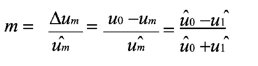
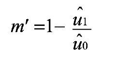

# WEEK 2

## Lecture 4:

### 一.The Checksum Procedure

#### 1.Checksum:

- Recognize transmission errors
- Initiate corrective measures: retransmission

#### 2.The most common checksum procedures

- Parity checks
- LRC
- CRC

#### 3.Parity Checking

- A parity bit is incorporated into each byte
- **9 bits** are sent for every byte
- **Odd parity**: an **odd number of the 9 bits have the value 1**
- **Even parity**: an **even number of the 9 bits have the value 1**
- Simple
- Poor error recognition
  - An odd number of inverted bits (1,3,5, …) : detected
  - An even number of inverted bits (2,4,6,…) : the errors cancel each other out,
    appear to be correct.

- **Sample Question:**
  - Odd parity: E5h, 1110 0101 p=0.
  - A parity generator for **even parity**: the **XOR logic gating** of all the data bits in a byte

#### 4.LRC Procedure

- LRC: Longitudinal redundancy check
- The XOR checksum is generated by the recursive XOR gating of all the data bytes in a data block.
- Byte 1 is XOR gated with byte 2, the outcome of this gating is XOR gated with byte 3, and so on.
- If the LRC value is appended to a data block and transmitted with it, then a simple check for transmission errors can be performed in the receiver by generating an LRC from the data block + LRC byte.
- The result of this operation must **always be zero**; any other result indicates that transmission errors have occurred.
- **Can be calculated very simply and quickly** 
- **Not very reliable** because it is possible for multiple errors to cancel each other out, and the check cannot detect whether bytes have been transposed within a data block
- **Primarily used for the rapid checking of very small data blocks (e.g. 32 byte)**

#### 5.CRC Procedure

- **CRC (cyclic redundancy check) procedure**: originally used in disk drives
- Excellently suited for error recognition
- Highly reliable method of **recognizing errors**
- **Cannot correct** errors
- A CRC checksum is calculated by the division of a polynomial using a so-called **generator polynomial**.
- The CRC value is the remainder obtained from this division.
- **CRC (cyclic redundancy check) procedure** : originally used in disk drives
  - The first byte of the data block is F7h=11110111
  - The generator polynomial is $x^4+x+1=10011$ 
  - The starting value : 0000𝐵

- **几个重要的点:**
  - **增加0的位数由多项式最高位次数来决定(eg. $x^4+x+1$ 的最高位为4次，所以应该增加4个0 0000)**
  - **每次异或后的结果对于从左往右的0要舍去，再从剩下位数中补缺少的位数**

- **Transmitter: calculate the CRC value, append to data block**
- **Receiver: calculate the CRC value of the received data, including the appended CRC byte**
- The result is always zero, unless transmission errors
- Both CRC calculations start from the same initial value
- **Advantage: reliability of error recognition**
- **A16-bit CRC : checking the data integrity of data blocks up to 4Kbytes in length**
- **RFID systems : data blocks, shorter than 4Kbytes, 12- and 8-bit CRCs**

### 二.CODING AND MODULATION

#### 1.Coding and Modulation

- From the reader to the transponder:
  - Signal coding the modulator in the reader (transmitter)
  - The transmission medium (channel)
  - The demodulator and signal decoding in the transponder (receiver)

- Matches the message optimally to the characteristics of the transmission  channel
-  Protection against interference or collision
- Protection against intentional modification
- Coding in the baseband

#### 2.Modulation

- Altering the signal parameters of a high frequency carrier
- Amplitude
- Frequency

- Phase

#### 3.Communication Medium

- Transmits the message over a predetermined distance
- Magnetic fields (inductive coupling)
- Electromagnetic waves (electromagnetic backscatter coupling)

#### 4.Demodulation

- Reclaim the signal in the baseband
- Contain both a modulator and a demodulator

- Modem

#### 5.Decoding

- Reconstruct the original message from the baseband-coded received signal
- Recognize any transmission errors and flag them

### 三.Coding in the Baseband

#### 1.NRZ coding (Not Return to Zero)

- **Binary 1 : a ‘high’ signal**
- **Binary 0 : a ‘low’ signal**

#### 2.Manchester Coding

- **binary 1: a negative transition**
- **binary 0: a positive transition**
- **used for data transmission from the transponder to the reader, based upon load modulation using a subcarrier**

#### 3.Unipolar RZ Coding

- **Binary 1 : a ‘high’ signal during the first half-bit period**
- **Binary 0 : a ‘low’ signal lasting for the entire duration of the bit**

#### 4.DBP (differential bi-phase)

- **Binary 0: a transition of either type in the half-bit period**
- **Binary 1: lack of a transition**
- **The level is inverted at the start of every bit period**
- **The bit pulse can be more easily reconstructed in the receiver**

#### 5.Miller coding

- **Binary1 : a transition of either type in the half-bit period**
- **Binary 0 : continuance of the 1 level over the next bit period**
- **A sequence of zeros : transition at the start of a bit period**
- **The bit pulse can be more easily reconstructed in the receiver**

#### 6.Modified Miller coding

- **each transition : a negative pulse**
- **highly suitable for use in inductively coupled RFID systems : data transfer from reader to transponder**
- 𝑡𝑝𝑢𝑙𝑠𝑒 << 𝑇𝑏𝑖𝑡 , ensure a continuous power supply to the transponder during data transfer

#### 7.Differential coding

- **binary 1 : a change (toggle) in the signal level**
- **binary 0 : the signal level remains unchanged**

#### 8.Pulse-pause coding (PPC)

- **binary 1 : a pause of duration t before the next pulse**
- **binary 0 : a pause of duration 2t before the next pulse**
- **popular in inductively coupled RFID systems: data transfer from the reader to the transponder**

#### 9.The most important consideration

- The signal spectrum after modulation
- Susceptibility to transmission error

- In the case of passive transponders,
  - Power supply must not be interrupted by an inappropriate combination of signal coding and modulation procedures.
    

### 四.Digital Modulation Procedures

#### 1.Digital Modulation Procedures

- **Modulation**
  - Influencing signal parameters – power, frequency, phase position – of an electromagnetic wave by messages (data)

- **Carrier**: an unmodulated electromagnetic wave
- **Demodulation**
  - Reconstruct the message
  - Analyzing the characteristics of an electromagnetic wave
  - Measuring the change in reception power, frequency or phase position of the wave

- **Analogue modulation**
  - Amplitude modulation
  - Frequency modulation
  - Phase modulation

- **Digital modulation:** used in RFID systems
  - ASK (amplitude shift keying)
  - FSK (frequency shift keying)
  - PSK (phase shift keying)

- **Symmetric modulation products (sidebands) are generated around the carrier.**
- The spectrum and amplitude of the sidebands are influenced by
  - The spectrum of the code signal in the baseband
  - The modulation procedure

#### 2.Amplitude Shift Keying (ASK)

- Amplitude of a carrier oscillation: switched between two states u0 and u1 , by a binary code signal.

- The duty factor m:

  

- **The duty factor:** the percentage carrier reduction m’ during keying

- In the case of **duty factors <15% and duty factors >85%**, the differences between the two calculation methods can be disregarded.

- **ASK modulation**: multiply the code signal by the carrier oscillation

$$
U_{ASK}(t) = (m⋅u_{code}(t) + 1 - m)⋅u_{HF}(t)
$$

- **The spectrum of ASK signals**: convolution of the code signal spectrum with the carrier frequency

#### 3.Frequency Shift Keying (FSK)

- 2FSK, the frequency of a carrier oscillation: switched between two frequencies f1 and f2, by a binary code signal

#### 4.Phase Shift Keying (PSK)

- 2PSK: switched between the phase states 0°and 180 ° corresponds with the multiplication of the carrier oscillation by 1 and -1

- The power spectrum of a 2 PSK can be calculated as follows for a mark-space ratio τ/T of 50%

$$
P(f) = \frac{P \cdot T_s}{2} \left[ \text{sinc}^2\left(\pi(f - f_0)T_s\right) + \text{sinc}^2\left(\pi(f + f_0)T_s\right) \right]
$$

**where P is transmitter power, Ts is bit duration (= τ ), f0 is centre frequency, and sin c(x) = (sin(x )/x ).**